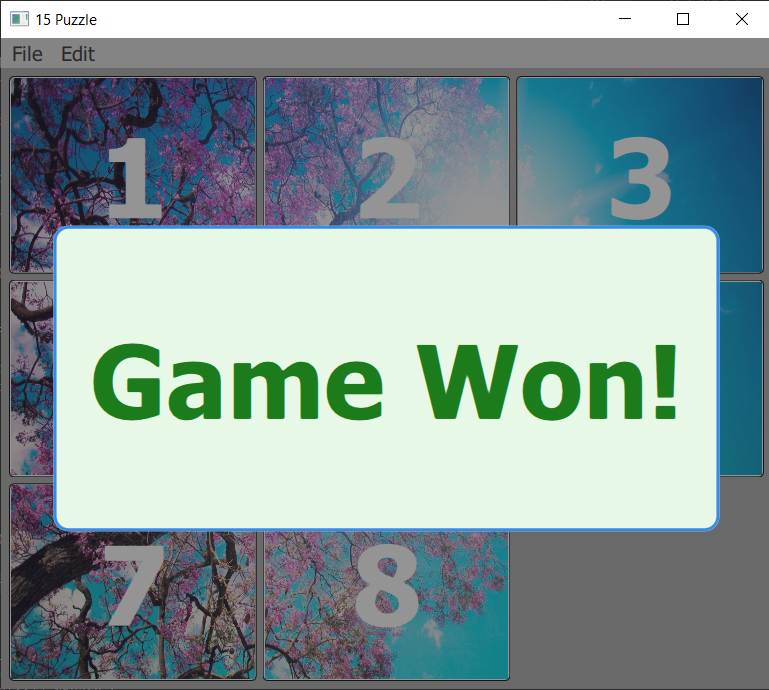
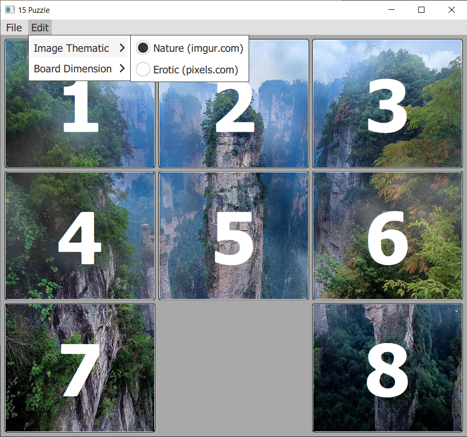
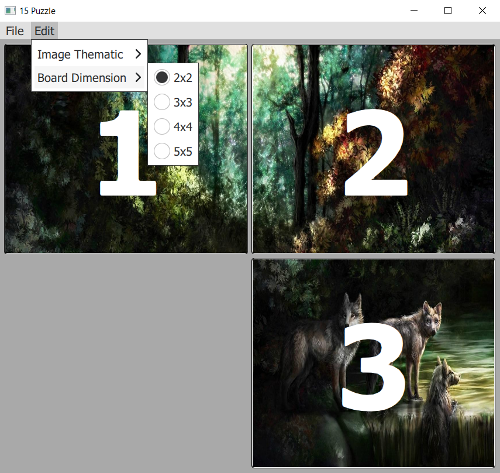
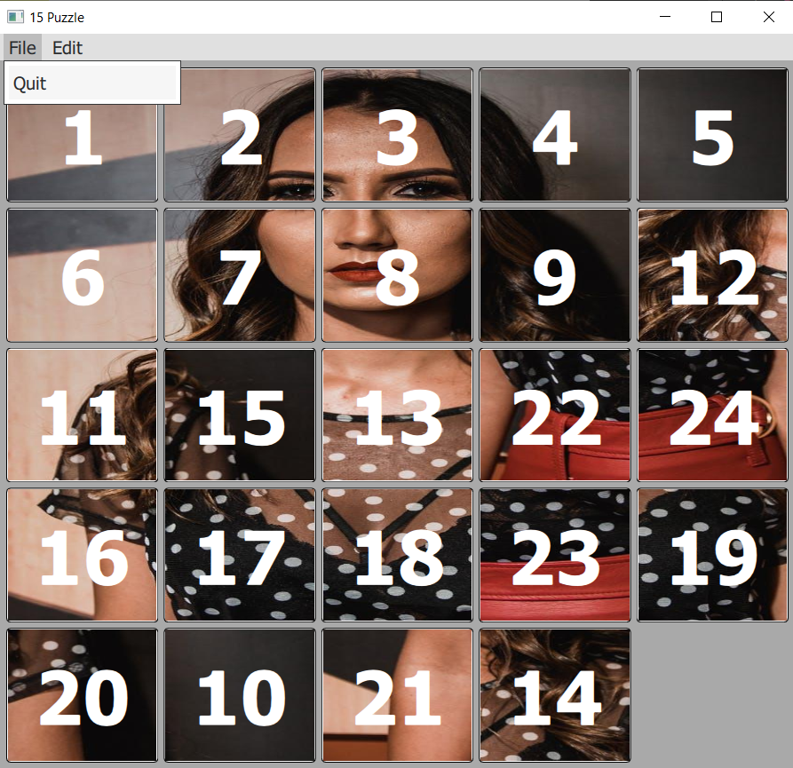

# 15 Puzzle Game
15 Puzzle game, developed with QML and C++ ***just for fun*** ! 

## How to clone
```bash
  git clone --recurse-submodules https://github.com/Childcity/15PuzzleGame.git
```

## Demonstration of working application
<p align="center">
  
</p>

## Some screenshots
<p align="center">
  
  
</p>

<p align="center">
  
  
</p>